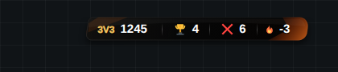
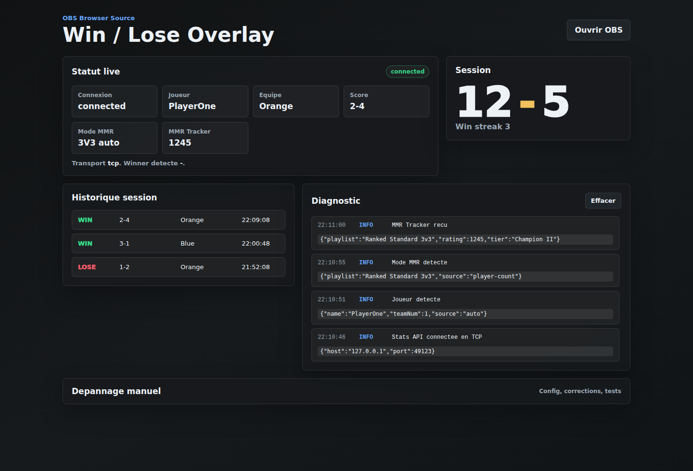

# Rocket League Win/Lose Overlay

Overlay OBS pour Rocket League qui affiche le MMR, les wins, les losses et la winstreak de la session.

Il utilise la Stats API officielle locale de Rocket League. Il ne hook pas le jeu, n'injecte rien, et fonctionne proprement avec EAC via OBS.

## Apercu





## Ce que ca fait

- Affiche une barre OBS transparente avec `MMR / WIN / LOSE / STREAK`.
- Compte automatiquement les wins/losses quand Rocket League envoie le gagnant.
- Compte aussi les FF/abandons quand le score final permet de deduire le resultat.
- Recupere le MMR via Tracker.gg quand le joueur et le mode sont detectes.
- Garde le dernier MMR affiche tant qu'un nouveau MMR valide n'est pas recu.
- Reset les wins/losses a chaque lancement par defaut, avec option pour les garder entre sessions.
- Fournit un dashboard local avec logs, historique et boutons de correction.

## Installation Rapide

### 1. Telecharger

Telecharge la derniere release :

```txt
https://github.com/julianout/RocketLeague-win-lose/releases/latest
```

Prends :

```txt
rocket-league-winlose-overlay-ready.zip
```

Dezippe le dossier ou tu veux.

### 2. Lancer

Double-clique :

```txt
START-WINDOWS.bat
```

Le launcher s'occupe de :

- installer Node.js LTS avec `winget` si Node manque ;
- verifier `npm` ;
- installer les dependances du projet ;
- activer la Stats API Rocket League avec backup ;
- ouvrir le dashboard ;
- lancer le serveur overlay.

Si Node.js ne peut pas etre installe automatiquement, installe Node.js LTS ici, puis relance le `.bat` :

```txt
https://nodejs.org/
```

### 3. Relancer Rocket League

Si le launcher a modifie la Stats API, ferme completement Rocket League puis relance-le.

Si ca reste en `connecting`, relance `START-WINDOWS.bat` en administrateur, puis relance Rocket League.

Config manuelle si besoin :

```txt
<Dossier Rocket League>\TAGame\Config\DefaultStatsAPI.ini
```

```ini
[TAGame.MatchStatsExporter_TA]
Port=49123
PacketSendRate=30
```

Le launcher affiche :

```txt
Panneau: http://localhost:5177/control.html
OBS:     http://localhost:5177/overlay.html
```

Garde cette fenetre ouverte pendant que tu joues.

### 4. Ajouter OBS

Ajoute une `Browser Source` avec :

```txt
http://localhost:5177/overlay.html
```

Reglages conseilles :

```txt
Width: 1920
Height: 1080
Custom CSS: vide
```

Pas besoin de CSS perso. Si OBS garde un ancien rendu, clique `Refresh cache of current page`.

## Version BakkesMod

Ce projet n'est pas un plugin BakkesMod natif. Le zip de release GitHub contient le launcher Windows complet avec `.bat`.

Pour publier sur le site BakkesMod, il faut utiliser un zip separe sans `.bat`, `.exe`, `.dll`, `.sh` ni fichiers interdits. Ce zip n'est pas attache a la release GitHub.

## Dashboard

Ouvre :

```txt
http://localhost:5177/control.html
```

En usage normal, tu n'as rien a regler. Le dashboard sert surtout a verifier :

- connexion Stats API ;
- joueur detecte ;
- equipe detectee ;
- score live ;
- mode MMR ;
- MMR Tracker ;
- historique de session ;
- logs utiles.

La partie `Depannage manuel` reste repliee. Elle sert seulement si l'auto-detection echoue ou si tu veux corriger un resultat.

Par defaut, les wins/losses repartent a zero quand tu relances l'overlay. Dans `Depannage manuel`, coche `Garder win / lose entre sessions` puis `Sauver` si tu veux conserver la session entre deux lancements.

## MMR

La Stats API officielle ne donne pas le MMR. L'app utilise donc Tracker.gg a partir du joueur detecte par Rocket League.

Detection du mode :

- si Rocket League envoie un champ playlist/mode, l'app l'utilise ;
- sinon l'app deduit le mode avec le nombre de joueurs : 1v1, 2v2, 3v3, 4v4 ;
- si l'auto se trompe, force le mode dans `Depannage manuel`.

Tracker.gg peut avoir du delai ou refuser temporairement certaines requetes. Dans ce cas, le win/loss continue de marcher.

## Logs Utiles

Messages importants dans le dashboard :

- `Stats API connectee en TCP` : l'app est connectee au port Rocket League.
- `Match state` : Rocket League envoie bien des donnees.
- `Joueur detecte` : l'app sait quelle equipe compter.
- `Mode MMR detecte` : l'app sait quel mode utiliser pour le MMR.
- `MMR Tracker recu` : le MMR a ete recu.
- `Resultat WIN/LOSE enregistre` : le match a ete compte.
- `Resultat deduit sur MatchDestroyed` : FF/abandon compte depuis le score final connu.

Si ca reste en `connecting`, ouvre `Depannage manuel`, puis clique `Test connexion`.
Si le test TCP echoue, ferme Rocket League et relance `START-WINDOWS.bat` en administrateur pour laisser le launcher modifier `DefaultStatsAPI.ini`.

## OBS Options

Cacher la barre permanente :

```txt
http://localhost:5177/overlay.html?hud=0
```

Changer la duree du toast WIN/LOSE :

```txt
http://localhost:5177/overlay.html?duration=9000
```

Mode demo pour verifier le rendu :

```txt
http://localhost:5177/overlay.html?demo=1&preview=1
http://localhost:5177/control.html?demo=1
```

## Notes

Un overlay au-dessus du plein ecran exclusif Rocket League n'est pas fiable sans hook/injection. Avec EAC, l'approche propre est OBS Browser Source.

Les fichiers locaux suivants ne sont pas commit :

- `config.json`
- `data/session.json`
- `data/overlay.log`
- `node_modules/`
